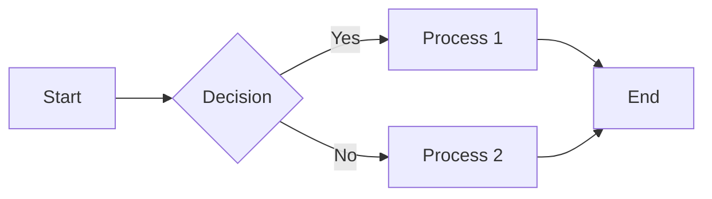
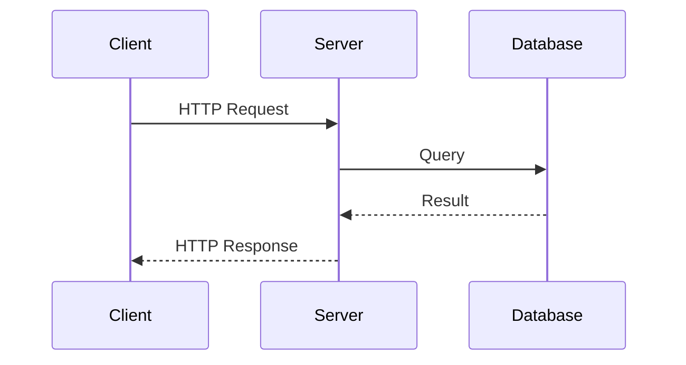
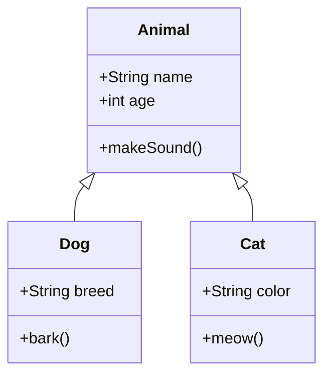
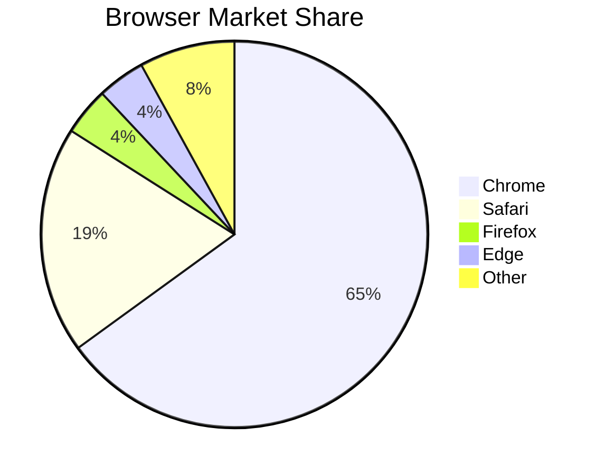
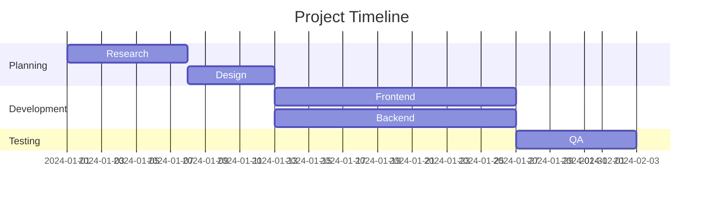

# Markdown Style Guide

This document demonstrates all Markdown syntax supported by this theme.

## Text Formatting

This is a regular paragraph with **bold text**, _italic text_, and **_bold italic text_**.

You can also use **underscores for bold** and _underscores for italic_.

~~Strikethrough text~~ is also supported.

This is a paragraph with `inline code` in it.

## Links

- [External link](https://github.com)
- [Link with title](https://github.com 'GitHub')
- <https://github.com> (autolink)
- [Reference-style link][ref]

[ref]: https://github.com 'Reference Link'

## Headings

# Heading 1

## Heading 2

### Heading 3

#### Heading 4

##### Heading 5

###### Heading 6

## Blockquotes

> This is a blockquote.
>
> It can span multiple paragraphs.

> Nested blockquotes:
>
> > This is a nested blockquote.
> >
> > > And this is even more nested.

> Blockquote with other elements:
>
> - List item 1
> - List item 2
>
> **Bold text** and `inline code`.

## Lists

### Unordered Lists

- Item 1
- Item 2
  - Nested item 2.1
  - Nested item 2.2
    - Deep nested item
- Item 3

### Ordered Lists

1. First item
2. Second item
   1. Nested item 2.1
   2. Nested item 2.2
3. Third item

### Task Lists

- [x] Completed task
- [ ] Incomplete task
- [ ] Another incomplete task
  - [x] Nested completed task
  - [ ] Nested incomplete task

### Definition Lists

Term 1
: Definition for term 1

Term 2
: Definition for term 2
: Another definition for term 2

## Code Blocks

Use `const` for constants and `let` for variables.

```javascript
function greet(name) {
  console.log(`Hello, ${name}!`)
  return true
}

greet('World')
```

```python
def fibonacci(n):
    """Generate Fibonacci sequence."""
    a, b = 0, 1
    for _ in range(n):
        yield a
        a, b = b, a + b

for num in fibonacci(10):
    print(num)
```

```go
package main

import "fmt"

func main() {
    fmt.Println("Hello, World!")
}
```

```css
.container {
  max-width: 980px;
  margin: 0 auto;
  padding: 0 32px;
}
```

```bash
#!/bin/bash
echo "Hello, World!"
npm install
npm run build
```

```json
{
  "name": "project",
  "version": "1.0.0",
  "dependencies": {
    "react": "^18.0.0"
  }
}
```

```yaml
name: CI
on:
  push:
    branches: [main]
jobs:
  build:
    runs-on: ubuntu-latest
    steps:
      - uses: actions/checkout@v4
```

## Tables

| Name  | Age | City   |
| ----- | --- | ------ |
| Alice | 25  | Tokyo  |
| Bob   | 30  | Paris  |
| Carol | 28  | London |

| Left | Center | Right |
| :--- | :----: | ----: |
| L1   |   C1   |    R1 |
| L2   |   C2   |    R2 |
| L3   |   C3   |    R3 |

| Feature       |   Free    |  Pro  | Enterprise |
| ------------- | :-------: | :---: | :--------: |
| Users         |     1     |  10   | Unlimited  |
| Storage       |    1GB    | 100GB |    1TB     |
| Support       | Community | Email | 24/7 Phone |
| API Access    |    No     |  Yes  |    Yes     |
| Custom Domain |    No     |  Yes  |    Yes     |

---

## Images



## Embeds

### YouTube Video



### Figma Design



## Mermaid Diagrams

### Flowchart



### Sequence Diagram



### Class Diagram



### Pie Chart



### Gantt Chart



## Special Elements

### Footnotes

Here is a sentence with a footnote[^1].

Another sentence with a different footnote[^note].

[^1]: This is the first footnote.

[^note]: This is a named footnote with more content.

### Keyboard Keys

Press <kbd>Ctrl</kbd> + <kbd>C</kbd> to copy.

Press <kbd>Cmd</kbd> + <kbd>V</kbd> to paste on macOS.

### Subscript and Superscript

H<sub>2</sub>O is water.

E = mc<sup>2</sup> is Einstein's equation.

### Collapsible Content

<details>
<summary>Click to expand</summary>

This is the hidden content that appears when you click.

- Item 1
- Item 2
- Item 3

```javascript
console.log('Hidden code!')
```

</details>

### HTML Elements

<mark>Highlighted text</mark>

<ins>Inserted text</ins>

<del>Deleted text</del>

<small>Small text</small>

<address>
123 Example Street<br>
City, Country 12345
</address>

## Typography

### Horizontal Rules

Three or more hyphens, asterisks, or underscores:

---

### Special Characters

- Em dash: —
- En dash: –
- Ellipsis: …
- Copyright: ©
- Trademark: ™
- Registered: ®
- Arrows: → ← ↑ ↓ ↔
- Symbols: ★ ✓ ✗ ♠ ♣ ♥ ♦

### Escaping

\*This is not italic\*

\`This is not code\`

\# This is not a heading

_End of Markdown Style Guide_
